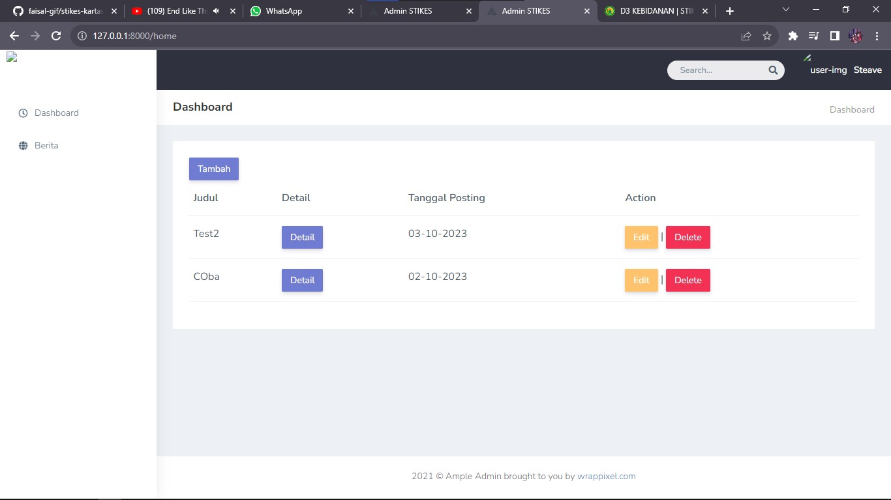

# Website Profile Stikes Kartasa

Website Profile Stikes Kartasa adalah website profile dari "STIKES Karya Putra Bangsa Tulungagung". 
Yang ditujukan untuk mempromosikan "STIKES Karya Putra Bangsa Tulungagung".

Proyek ini dibangun dengan menggunakan Laravel, Boostrap, dan Mysql untuk manajemen database.
## Teknologi Yang Digunakan 

Framework : Laravel, Boostrap

Database : Mysql

## Screenshot

### Landing


### Admin




## Prasyarat

Pastikan Anda telah menginstal [Laravel](https://laravel.com/) dan [Composer](https://getcomposer.org/) di sistem Anda sebelum menjalankan proyek ini.

## User

Username : admin@gmail.com

Password : admin1234


## Instalasi

1. Clone repositori ini:

   ```bash
   git clone https://github.com/faisal-gif/stikes-kartasa.git
   ```
   
2. Masuk ke direktori proyek:

   ```bash
   cd stikes-kartasa
   ```

3. Salin file .env.example menjadi .env dan sesuaikan pengaturan database:

   ```bash
   cp .env.example .env
   ```

4. Jalankan perintah berikut untuk menginstal dependensi:

   ```bash
   composer install
   ```

5. Install dependensi JavaScript menggunakan npm:

   ```bash
   npm install
   ```
   ```bash
   npm run build
   ```

6. Generate key aplikasi Laravel:

   ```bash
   php artisan key:generate
   ```
7. Migrasi dan isi database dengan perintah berikut:

   ```bash
   php artisan migrate --seed
   ```

8. Jalankan server pengembangan Laravel

   ```bash
   php artisan serve
   ```
